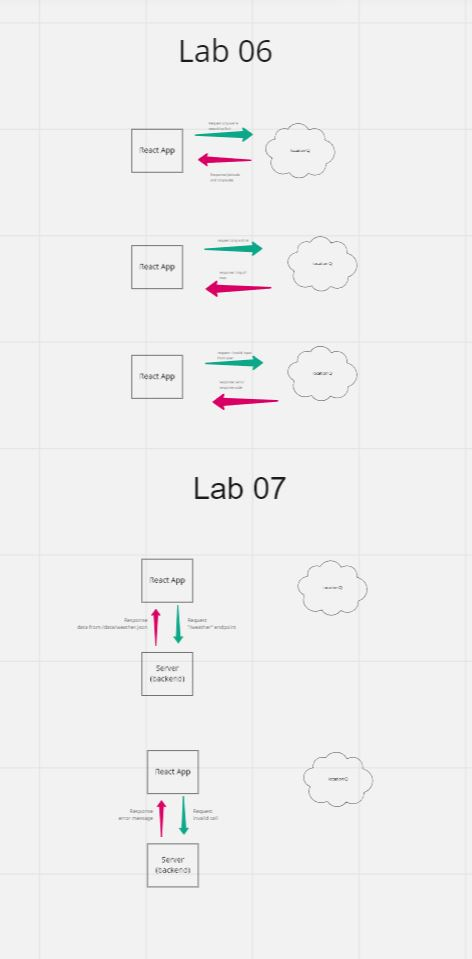

# City Explorer Frontend

**Author**: Raymond Ruazol
**Version**: 1.0.2

## Overview
Display information on a given city such as weather, movies, etc.

## Getting Started
1. Clone repo
2. Install packages `npm install`
3. Have the backend server running - [Github Repo](https://github.com/rpruazol/city-explorer-backend)
4. Create your own `.env` file with your `REACT_APP_LOCATION_IQ` and `REACT_APP_SERVER_URL` environment variables

## Architecture

This app is created using React and using the following packages:
1. bootstrap
2. bootstrap-react
3. axios

## Change Log

08-04-2022 9:00pm - Lab-06 complete
08-06-2022 9:00pm - Lab-07 complete

## Diagrams
### Web Request Response (WRRC) Diagram
